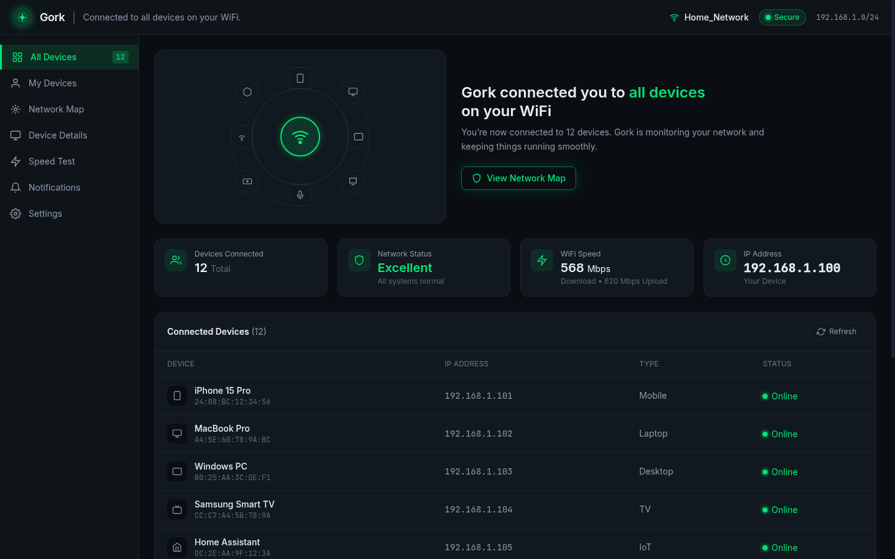

# Gork Network Management Dashboard

High-fidelity modern dark-mode UI rebuild of the **Gork** WiFi / network management dashboard.



## Live

Open `index.html` or deploy instantly:

[](https://vercel.com/new/clone?repository-url=https://github.com/bnwwzf8sbh-cell/gork-dashboard)

## Features

- Exact layout matching the design reference: top bar, left sidebar, network map graphic, hero, stats cards, device table
- All 12 connected devices with name, MAC, IP, type, and green Online status
- Neon green (`#00e676`) cyber accents on deep charcoal panels
- Crisp Inter + JetBrains Mono typography
- Responsive table + hover states
- "View Network Map" CTA, Refresh button, protection status footer

## Quick start

```bash
# just open it
open index.html

# or serve
npx serve .
# → http://localhost:3000
```

## Deploy to Vercel

1. Fork / clone this repo
2. Import on [vercel.com](https://vercel.com/new)
3. Deploy — zero config (static)

Or click the Deploy button above.

## Stack

- Single-file HTML + Tailwind CSS (CDN)
- Custom CSS for neon glow / status dots / progress
- No build step required

Built from the Gork design reference asset.
